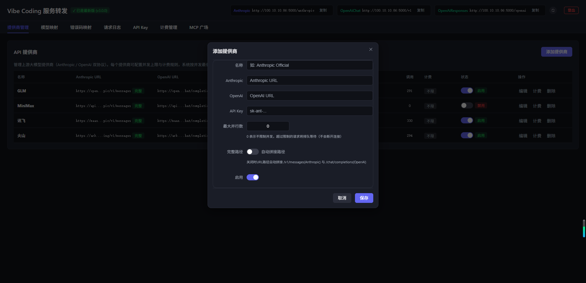
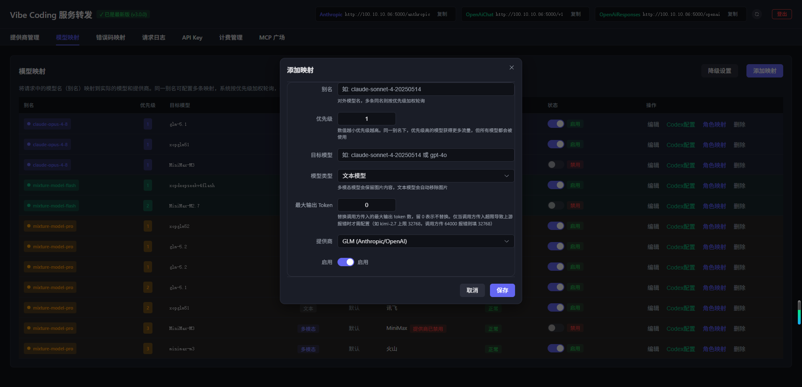
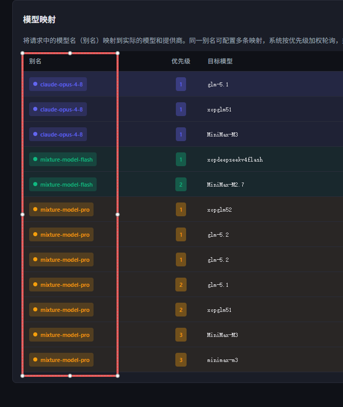
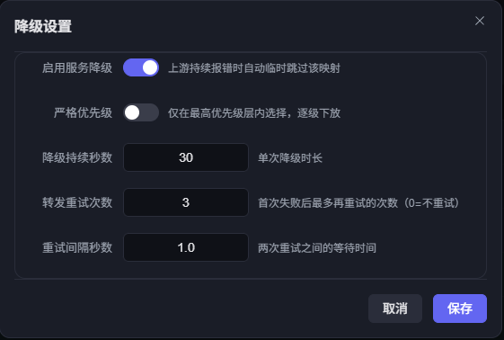
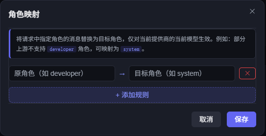
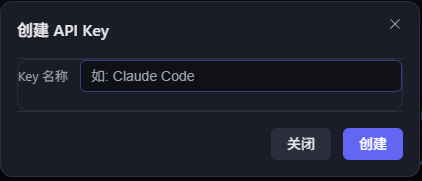
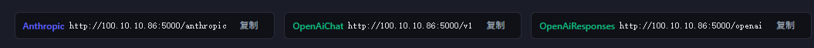

## 添加提供商

进入「提供商管理」Tab → 点击「添加提供商」按钮，填写以下信息：

| 字段 | 说明 |
| --- | --- |
| 名称 | 提供商显示名，如 `Anthropic Official`、`智谱` |
| Anthropic | Anthropic 协议的 URL，留空则不转发 Anthropic 请求 |
| OpenAI | OpenAI 协议的 URL，留空则不转发 OpenAI 请求 |
| API Key | 上游提供商的 Key |
| 最大并行数 | 0 = 不限；N = 同时最多 N 个请求 |
| 完整路径 | 开关。打开 = URL 原样使用；关闭 = 自动拼接路径后缀 |
| 启用 | 开关。关闭后该提供商不参与转发 |

### 完整路径怎么选？

**打开**：你填的 URL 是完整地址，系统不会自动拼接任何后缀。

**关闭（默认）**：你只填到 base 路径，系统会自动补全：

- Anthropic URL 后面自动拼 `/v1/messages`
- OpenAI URL 后面自动拼 `/chat/completions`

举例：智谱官方给的 OpenAI 地址是 `https://open.bigmodel.cn/api/coding/paas/v4`，实际完整路径是 `https://open.bigmodel.cn/api/coding/paas/v4/chat/completions`。此时关闭「完整路径」，系统会自动帮你补上 `/chat/completions`。

## 模型映射

进入「模型映射」Tab → 点击「添加映射」按钮：

| 字段 | 说明 |
| --- | --- |
| 别名 | 客户端请求时用的模型名，如 `claude-sonnet-4`。**同一个别名配多条映射 = 负载均衡池**，系统按优先级加权轮询选择 |
| 优先级 | 数字越小优先级越高 |
| 目标模型 | 上游真实模型名，如 `claude-sonnet-4-5-20250929` |
| 模型类型 | 文本模型 / 多模态模型（支持图片） |
| 最大输出 Token | 0 = 不覆盖；>0 = 强制覆盖请求的 max_tokens |
| 提供商 | 选择一个已添加的提供商 |
| 启用 | 开关。关闭后该映射不参与转发 |

### 模型别名与负载均衡

同一个别名可以配多条映射，每条指向不同的提供商或目标模型，构成负载均衡池。系统按优先级加权轮询选择，按客户端 IP 隔离（同一 IP 的请求会均匀分布到不同上游）。

如果只配一条映射，就是精确匹配，直接走那一条。

### 模型降级

当某个上游转发失败后，会被临时"降级"一段时间，后续请求自动绕过它、切换到其他健康上游。

点击「降级设置」按钮可配置：

| 配置项 | 默认值 | 说明 |
| --- | --- | --- |
| 启用服务降级 | 关闭 | 打开后故障的上游会被临时跳过 |
| 严格优先级 | 关闭 | 打开后只在最高优先级层内选择，整层降级才下放到更低层 |
| 降级持续秒数 | 30 | 失败上游被跳过的时长 |
| 转发重试次数 | 3 | 单次转发失败后最多再重试几次（0 = 不重试） |
| 重试间隔秒数 | 1.0 | 两次重试之间的等待时间 |

表格中有一列「降级状态」，实时显示每个映射是"正常"还是"降级（剩余 Xs）"。

### 最大输出 Token

在模型映射中设置「最大输出 Token」可以强制覆盖请求中的 max_tokens：

- 填 0：不覆盖，用请求自带的值
- 填 >0：无论请求带什么值，都用你设的值

适用场景：某个上游模型最大只支持 8192，但客户端可能请求 32768，设了 8192 就不会超限报错。

### 角色替换

有些上游不认 `developer` 角色（只认 `system`），但 Claude Code / Codex 发来的消息用的是 `developer`。可以在模型映射弹窗底部添加角色映射规则：

| 原角色 | 目标角色 |
| --- | --- |
| developer | system |

转发前，请求中的 `developer` 消息会被替换为 `system`，并自动归入 Anthropic 顶层 `system` 字段。

## 创建 API Key

进入「API Key」Tab → 输入 Key 名称 → 点击「添加」。

系统会生成 `sk-` + 48 位随机串的 Key，**只显示一次**，请立即保存。列表中之后只显示前缀（如 `sk-xxxxxxxx...`）。

这个 Key 是给客户端用的，不是上游大模型的 Key。

## 快速复制代理地址

页面右上角有一排代理地址，每个旁边都有「复制」按钮，点击即可复制完整地址到剪贴板：

- **Anthropic**：`http://127.0.0.1:5000/anthropic`
- **OpenAiChat**：`http://127.0.0.1:5000/v1`
- **OpenAiResponses**：`http://127.0.0.1:5000/openai`

