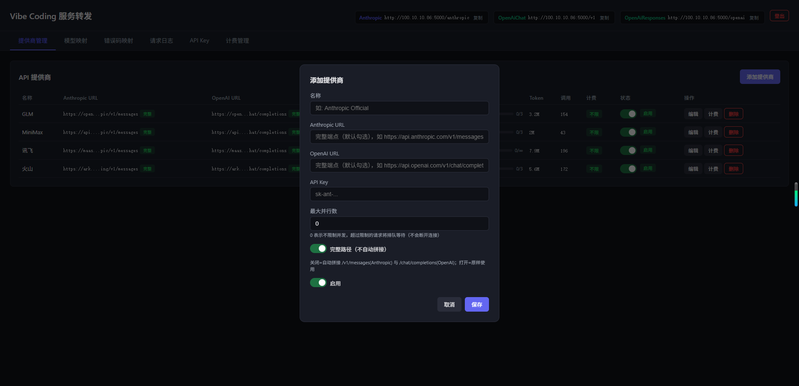

## 添加提供商

默认的认为配置的 url 地址全部是完整路径，实际上实际上运行商提供的地址都并非完整路径。

以质谱官方给出的地址为例

官方 opan ai 地址为：https://open.bigmodel.cn/api/coding/paas/v4 

实际完整路径应该是：https://open.bigmodel.cn/api/coding/paas/v4/chat/completions

当关闭“完整路径”开关时会在配置的 url 上自动拼接 /v1/messages(Anthropic) 与 /chat/completions(OpenAI)

当打开“完整路径”开关时认为配置的就是完整 url 则不会自动拼接不全

## 模型映射

### 模型别名

### 模型降级

### 最大词元

### 角色替换

