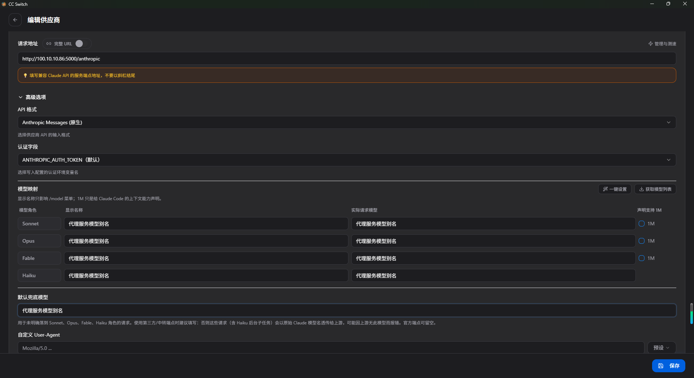

用 cc-switch 给 Claude Code 接入代理。

> 代理服务里「创建 API Key」「添加提供商」「模型映射」等通用操作都写在 [软件使用手册](软件使用手册.md) 里，这里只讲 Claude Code 专属的部分。

## 在 cc-switch 里配置

打开 cc-switch → 找到 Claude Code → 添加自定义配置：

| 配置项 | 值 |
| --- | --- |
| 请求地址 | `http://127.0.0.1:5000/anthropic`（代理页面右上角可一键复制） |
| API Key | 代理服务创建的 Key（`sk-` 开头，不是上游大模型的 Key），创建方法见 [软件使用手册 · 创建 API Key](软件使用手册.md#创建-api-key) |

模型映射里给目标模型起的**别名**（如 `claude-sonnet-4`），就是 Claude Code 请求时用的 `model`。

其他选项按需配置即可。

## 测试

在 Claude Code 中发一条消息，能正常返回就说明配置成功了。

---

## 常见问题

**Q: 报错 `401 Unauthorized`？**
A: 填的 API Key 必须是代理服务的 Key（`sk-` 开头），不是上游大模型的 Key。

**Q: 报错路径找不到？**
A: 请求地址必须是 `/anthropic` 结尾（页面右上角「Anthropic」那一栏），不是 `/v1`。

**Q: 上游只认 `system` 不认 `developer`？**
A: 在「模型映射」给这个别名加一条角色映射 `developer → system`，配置方法见 [软件使用手册 · 角色替换](软件使用手册.md#角色替换)。
