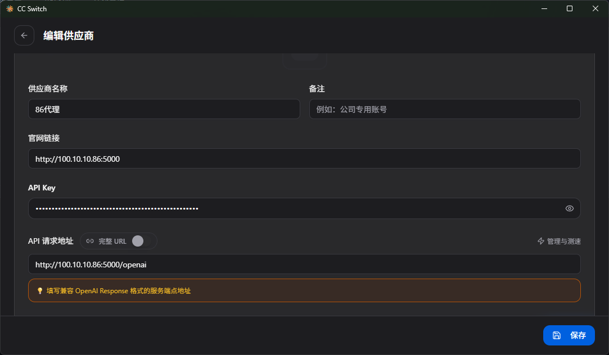
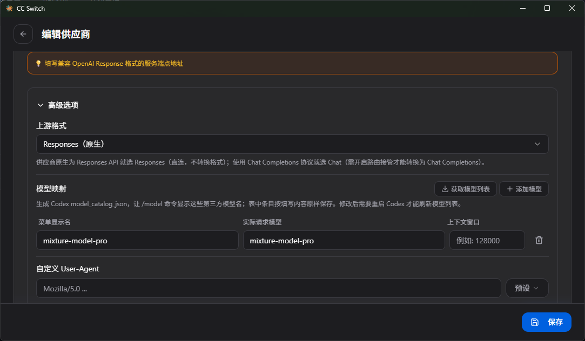
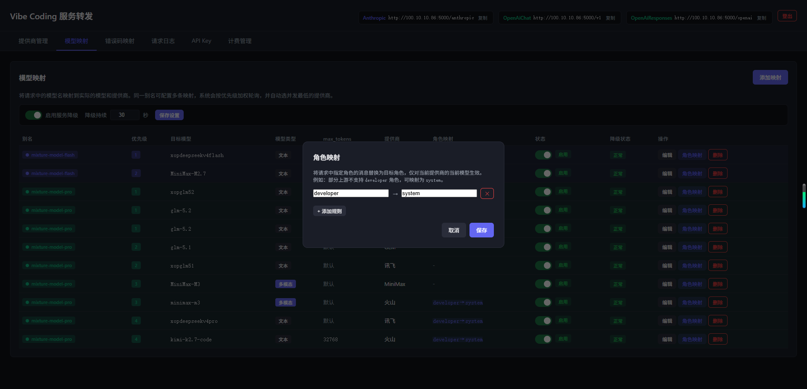

需要注意Codex Cli 新版本已经采用的不是OpenAiChat而是OpenAiResponses，所以这里需要注意不要使用 "/v1" 的转发地址。

请求地址配置成代理服务的 http://127.0.0.1:5000/openai（可通过管理界面右上角快速复制）

API Key 则是配置代理服务 "API Key" 界面创建的（非提供商大模型的key）



可选配置项配置如图即可。

模型映射则配置，代理服务为目标模型起的“别名”

需要注意的1！！！！！！上游格式配置为 Responses( 不需要开启cc-switch路由再转一次)



需要注意的2！！！！！！！

因为Codex Cli 原本接入的是 Chat Gpt 模型的，最新模型对话里面新增了 “developer” ，国内有些coding plan 是不认“developer” 角色的。

可以通过代理服务 “模型映射” 界面中为某一个模型单独设置 “角色映射” 如下图



## 推理（reasoning）配置与透传说明

Codex CLI 在 `wire_api = "responses"` 模式下支持 `model_reasoning_effort` 配置。代理会按模型映射的「透传思考强度参数」开关决定是否把 `reasoning_effort` 透传给上游：

- `model_reasoning_effort = "high"` / `"medium"` / `"low"` 会被提取并在转发 Chat Completions 上游时映射为 `reasoning_effort`（适配 DeepSeek-R1、GLM-5.x 等支持推理字段的模型）。
- 模型映射的「透传思考强度参数」开关默认开启。GLM/DeepSeek 原生认此字段；MiniMax 接受但不调深度（无害）；火山/讯飞/Kimi 参数名不同，传过去多半被上游忽略（不报错）。若个别上游实测出现 400，可在模型映射弹窗中关闭该开关。
- 上游返回的 reasoning / reasoning_content 流式字段会被转换为 OpenAI Responses API 的 `reasoning_summary_*` 事件序列透传给 Codex，Codex 会在 UI 中展示推理过程。

建议 `~/.codex/config.toml` 关键配置：

```toml
model_provider = "custom"
wire_api = "responses"                 # 必须使用 Responses 协议
base_url = "http://127.0.0.1:5000/openai"
model = "mixture-model-pro"            # 代理侧模型映射别名
model_reasoning_effort = "high"        # 按需启用推理
# disable_response_storage = true      # 可选：Codex 默认会把完整上下文塞进 input，减少依赖 OpenAI 存储
# requires_openai_auth = true          # 如果代理启用了 API Key 鉴权
```

**`disable_response_storage = true` 的含义与建议**

Codex CLI 默认会请求 OpenAI 在服务端保存对话（`store: true`），后续每轮通过 `previous_response_id` 引用。由于本代理转发到的是国内 Chat Completions 上游，没有 OpenAI 的 storage 服务，因此建议开启 `disable_response_storage = true`。开启后 Codex 会在每轮请求中把完整上下文放进 `input` 字段，代理可以直接转发给上游，不会触发存储相关错误。

**接入检查清单**

1. 管理界面右上角确认 OpenAI Responses 端点是 `/openai`，不是 `/v1`。
2. 在「API Key」页创建 Key，填入 Codex 配置；不要直接填上游大模型 Key。
3. 在「模型映射」页给目标模型起别名（例如 `mixture-model-pro`），并让 Codex 配置中的 `model` 等于该别名。
4. 若上游不认 `developer` 角色，在该映射行点击「角色映射」，添加 `developer -> system`。
5. 如需推理效果，确认模型映射的「透传思考强度参数」开关已开启（默认开启）；代理会在遇到 400 时自动 failover 降级重试。
