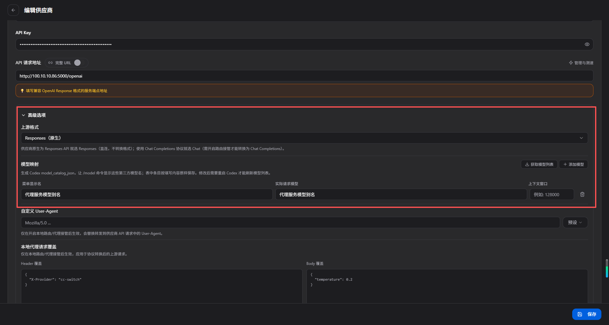

用 cc-switch 给 Codex CLI 接入代理。

> Codex CLI 新版本用的是 **OpenAI Responses** 协议（不是 Chat Completions），所以请求地址要用 `/openai`，不能用 `/v1`。
>
> 代理服务里「创建 API Key」「添加提供商」「模型映射」等通用操作都写在 [软件使用手册](软件使用手册.md) 里，这里只讲 Codex 专属的部分。

## 在 cc-switch 里配置

打开 cc-switch -> 找到 Codex CLI -> 添加自定义配置：

| 配置项 | 值 |
| --- | --- |
| 请求地址 | `http://127.0.0.1:5000/openai`（代理页面右上角可一键复制） |
| API Key | 代理服务创建的 Key（`sk-` 开头，不是上游大模型的 Key），创建方法见 [软件使用手册 · 创建 API Key](软件使用手册.md#创建-api-key) |

**关键：上游格式必须选 Responses**，不要选 Chat Completions，也不需要开启 cc-switch 的格式转换。

模型映射里给目标模型起的**别名**（如 `gpt-4o`），就是 Codex 请求时用的 `model`。

## 测试

在 Codex CLI 中发一条消息，能正常返回就说明配置成功了。

---

## 常见问题

**Q: 报错 `404`？**
A: 请求地址必须是 `/openai` 结尾（页面右上角「OpenAiResponses」那一栏），不是 `/v1`。

**Q: 国内某些上游不认 `developer` 角色？**
A: Codex 默认会发 `developer` 角色消息，部分国内上游只认 `system`。在「模型映射」给这个别名加一条角色映射 `developer -> system`，配置方法见 [软件使用手册 · 角色替换](软件使用手册.md#角色替换)。

